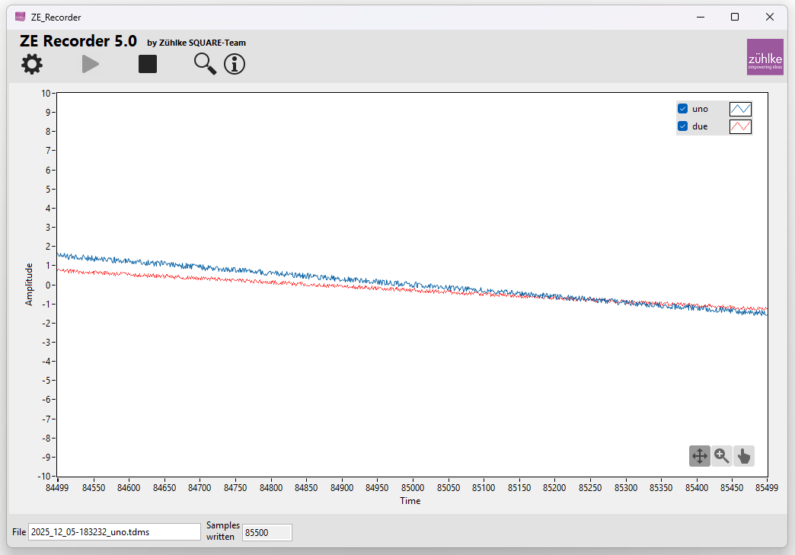
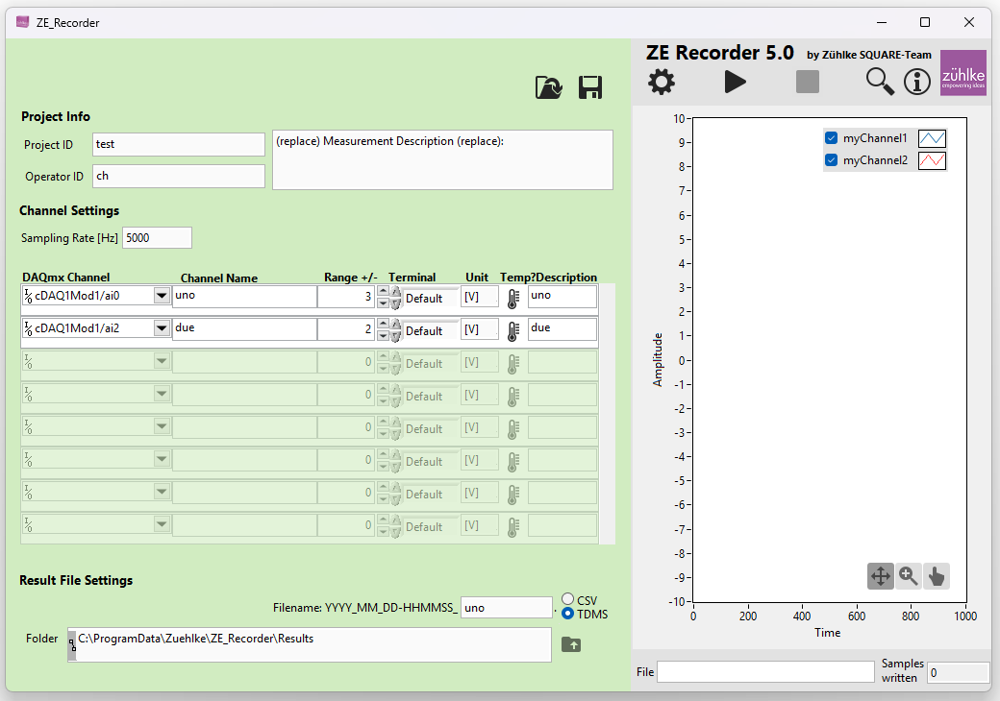

# ZE Recorder

---

## Table of Contents

- [Version](#version)
- [Introduction](#introduction)
- [GUI](#gui)
  - [Top Toolbar Buttons](#top-toolbar-buttons)
- [Specifications](#specifications)
- [Installation](#installation)
- [User Manual](#user-manual)
  - [Project Info](#project-info)
  - [Channel Settings](#channel-settings)
  - [Result File Settings](#result-file-settings)
- [Flex Logger](#flex-logger)

---

## Version

This description applies to **version 5.0** of the ZE Recorder.

## Introduction

The ZE Recorder provides an easy way to acquire measurement data using **NI‑DAQ hardware** and save it to CSV or TDMS files.

> ⚠️ The installer does **not** include the LabVIEW Run‑Time Engine or the NI‑DAQmx drivers.  
> These must be installed manually by the user before the software can be fully used.  
> **Required versions:** Microsoft Windows **11**, LabVIEW Runtime **2025 Q3 (32‑bit)**, NI‑DAQmx **2025 Q4**.

For fast data acquisition, a **USB‑DAQ device** is recommended.

---

## GUI

The ZE Recorder GUI consists of a **main window** with a resizable layout, starting from a predefined minimum size.

### Top Toolbar Buttons:

-  **Open PDF manual** – Opens the user manual.  
-  **Open TDMS Viewer** – Opens the TDMS Viewer.  
-  **Toggle configuration panel** – Show/hide the configuration area.  
-  **Start measurement** – Starts the data acquisition.  
-  **Measurement indicator** – Blinks during a running measurement.  
-  **Stop measurement** – Stops the ongoing measurement.

When the configuration panel is visible, an **additional section** appears below the main view where measurement settings and parameters can be adjusted.

---

## Specifications

Measurement specifications primarily depend on the **hardware used**.

| Parameter | Value | Parameter | Value |
| --- | --- | --- | --- |
| **Max. number of channels** | Depends on the connected hardware | **Max. sampling rate** | Depends on hardware resolution. Configurable for all channels simultaneously. 0.001 Hz to 1,000,000 Hz |
| **Number of devices** | Unlimited, as long as max. sampling rate is maintained. Channels must be ordered per device. | **Storage format** | CSV or TDMS (selectable) |
| **Voltage range** | Depends on hardware. Usually ±10 V | **Supported devices** | All NI‑DAQ controllable devices |
| **Resolution** | Depends on hardware. Configurable per channel via "Range" | **System requirements** | Microsoft Windows **11** PC, NI‑DAQ hardware, **LabVIEW Runtime 2025 Q3 (32‑bit)**, **NI‑DAQmx 2025 Q4** |

---

## Installation

The ZE Recorder installer can be found here:

[https://github.com/Zuehlke/ze_recorder](https://github.com/Zuehlke/ze_recorder)

**Installation steps:**

1. Copy the installer files to a local drive.  
2. Run `Setup.exe`.

> ⚠️ The installer installs only ZE Recorder components, **not** NI‑DAQmx drivers or LabVIEW Run‑Time Engine.  
> **Required versions:** Microsoft Windows **11**, LabVIEW Runtime **2025 Q3 (32‑bit)**, NI‑DAQmx **2025 Q4**.  
> These must be installed manually before the software can be fully used.

**External download links:**

- **LabVIEW Runtime 2025 Q3 (32‑bit)**  
  [Download LabVIEW 2025 Q3 Runtime](https://www.ni.com/en/support/downloads/software-products/download.labview-runtime.html?srsltid=AfmBOoo_VRTvrEjGC4yUbKw5PD-cgCiZqeOJ4lvX5MQeZtvF8t8xQQv#569299)

- **NI-DAQmx 2025 Q4**  
  [Download NI-DAQmx](https://www.ni.com/en/support/downloads/drivers/download.ni-daq-mx.html?srsltid=AfmBOopUIAd-oOh0jKBvCTbXY8udMrAmUMAW3XPASRtCGILwLCNhVqzd#577117)

**Default installation paths:**

| Component | Path |
| --- | --- |
| Executable | `C:\Program Files (x86)\Zuehlke\ZE_Recorder` |
| Configuration & result files | `C:\Program Data\Zuehlke\ZE_Recorder` |

---

## User Manual

1. **Start Measurement**  
   - Measurements can only start if at least **one channel** is configured and the **file name** and **folder** are not empty.  
   - Current data from all channels is displayed as a **graph** (default: last 1000 values). X-axis range can be adjusted.

2. **Open TDMS Viewer**  
   - Opens a new window for viewing data.  
   - To see **parameters, data, and graph** on the right, select a **data group** (Measurement Data) or an **individual channel** on the left.  
   - Only the **first 1000 values per channel** are displayed by default. This can be changed via the “Settings…” button.

> ⚠️ Configuration can only be changed if **no measurement is running**.

### Project Info

Fields: `Project ID`, `Operator ID`, `Description`.  
- No impact on measurement.  
- Stored as **metadata** in the result file.

### Channel Settings

| Field | Description | Required |
| --- | --- | --- |
| **DAQmx Channel** | Dropdown to assign available physical channels (analog input only) | Yes |
| **Range (+/-)** | Set the ADC range; should match expected signal. Always symmetric around 0V | Yes |
| **Terminal** | Terminal configuration of the measurement | Yes |
| **Unit** | Measurement unit, stored in channel description | Yes |
| **Temp?** | Marks channels for temperature measurement; corresponding DAQ module used | Yes |
| **Description** | Channel description, written into TDMS file | Optional |
| **Sampling Rate** | Sampling rate in Hz (0.001 Hz – 1,000,000 Hz) | Yes |

- Multiple independent DAQ devices can be used; channels must be **ordered per device**. Software will verify and reorder if needed.  
- Channels marked with **Temp?** support **thermocouples and RTD sensors**. The recorder automatically calculates temperature after parameters are entered. For custom setups, raw voltage data recording is recommended.

### Result File Settings

- File names are generated from **timestamp + configurable postfix**, e.g., `2020_08_12-141300_Test.tdms`.  
- Files can be saved as **CSV or TDMS**.  
- Default save path: `C:\Program Data\Zuehlke\ZE Recorder\Config`.  
- Alternate folder can be set in the “Folder” field.

> When closing the software via the `X` button, parameters are saved to:  
> `ZE_Recorder_Config.xml` in `C:\Program Data\Zuehlke\ZE_Recorder\Config` and reloaded on next start.

---

## Flex Logger

A key goal of ZE Recorder is **KISS (Keep It Stupid Simple)**.

For advanced applications, **NI Flex Logger** can be used, providing:

- **Automatic file splitting** – define when to switch to a new file for long-term measurements.  
- **Triggered measurements** – start measurement on configurable events; pre/post-event durations configurable.  
- **Multiple sampling rates** – record channels at different rates.  
- **Configurable display** – customize data visualization to your needs.

> ⚠️ Not all NI hardware is supported.  
> Supported: cDAQ chassis 91xx with C-series modules.  
> Not supported: older USB 6xxx series, Virtual Bench, MyDAQ.  
> [Supported hardware list](https://www.ni.com/documentation/en/flexlogger/1.9/manual/supported-hardware/)

More info: [NI FlexLogger](https://www.ni.com/en-us/shop/data-acquisition-and-control/flexlogger.html)
